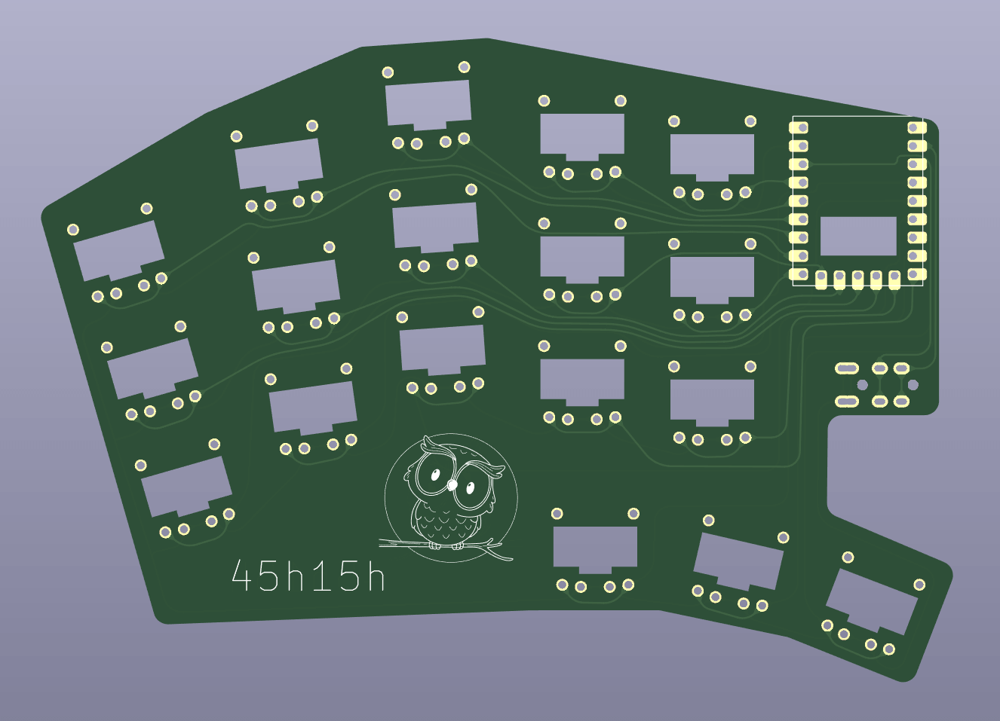
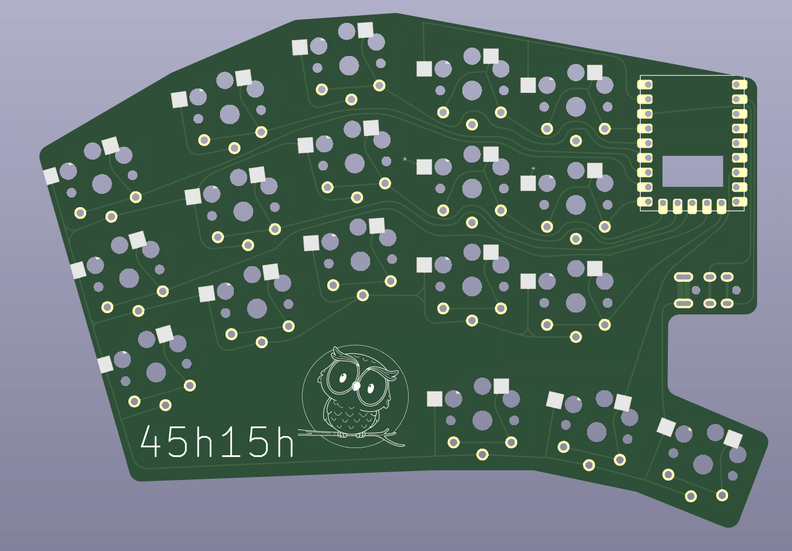

= Mini Keyboard

CAUTION: Here be Dragon

This is my experiment with https://ergogen.xyz[Ergogen] and building
a keyboard from scratch.

I had a bunch of https://www.waveshare.com/wiki/RP2040-Zero[RP2040 Zero]
microcontrollers and Choc Mini switches to play with. Even though I am
used to 34 keys, https://github.com/axhixh/haigha-mod[Haigha Mod], and 
use it as my daily driver, I decided to build one with 36 keys because
I can do that without using diodes.

== Choc v1 vs Choc mini

While I did design this keyboard to play with Choc mini switches, I did
create a Choc v1 version since it was easy with Ergogen and I wanted to
see how to make reversible, hot-swappable PCB.

The Choc mini version of the PCB is in link:choc-mini[] and the Choc v1
version is in link:choc-v1[].

== Releases

Please download the latest gerber files for the key switch you need from
https://github.com/axhixh/mini-kbd/releases[Releases]

== Firmware

The `firmware` folder contains different firmwares for the board.
Currently, it supports https://kmkfw.io[KMK]

== Future Experiments

 * Replace the third thumb key with an encoder, EVQWGD001.
 * Use a https://shop.pimoroni.com/en-us/products/trackball-breakout[Pimoroni trackball]
   as a pointer.

== References

While creating design I used https://github.com/mitxela/kicad-round-tracks[round-track]
plug-in.

The RP2040 Zero footprint is a modified version of https://github.com/CountParadox/RP2040-Zero-Kicad.
A possible improvement for future is to change it to have the origin in the center so
that rotating the footprint is easier.

